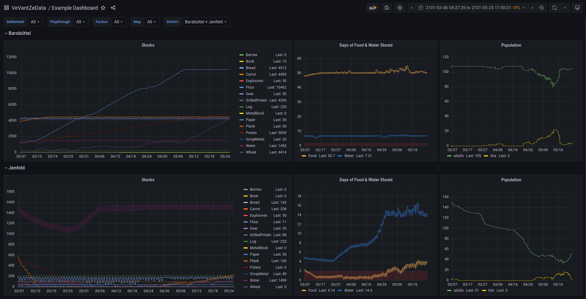

# Ve Vant ze Data Timberborn!

This is a mod for the game [Timberborn by Mechanistry](https://mechanistry.com/).

It streams data from the game to [InfluxDB](https://www.influxdata.com/) and/or CSV files. This allows the creation of nice graphs as shown above in [Grafana](https://grafana.com/grafana/) which can be viewed in the browser.

Read more about its features [here](doc/FEATURES.md).

Check out the change log [here](doc/CHANGELOG.md).

## Thunderstore

You can install the mod directly from [Thunderstore](https://timberborn.thunderstore.io/package/thundersen/VeVantZeData/). (The similarity of my username is a coincidence.)

## Manual Installation

This mod is based on `BepInEx`. So you need to install that first: https://docs.bepinex.dev/articles/user_guide/installation/index.html

[Download](https://github.com/thundersen/vevantzedata/releases) the latest release of the mod and unzip it into your BepinEx plugin folder.

## InfluxDB and Grafana

Find instructions for Docker (recommended) and manual installation [here](doc/INFLUXDB_GRAFANA.md).